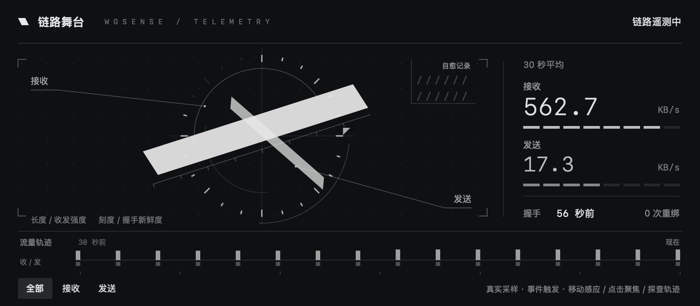
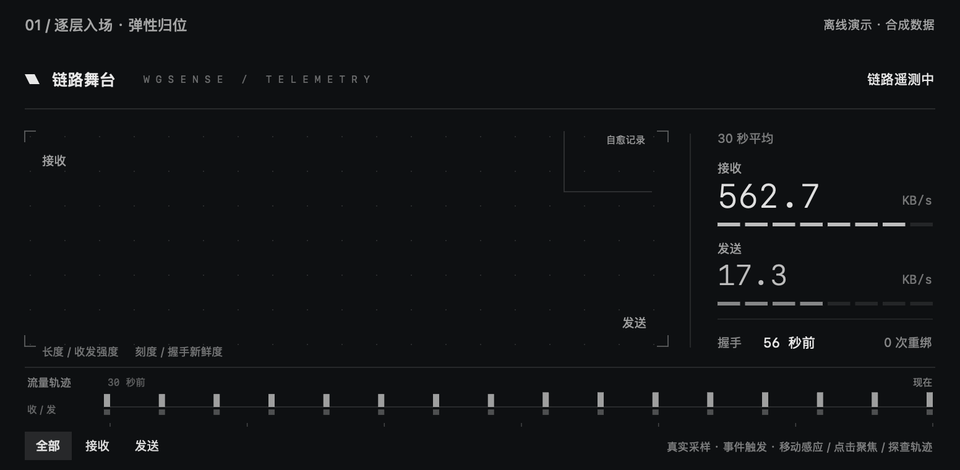
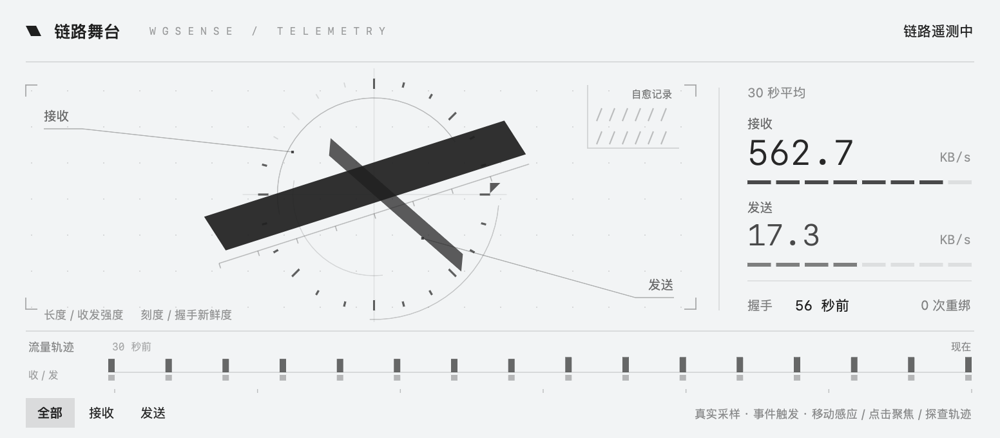
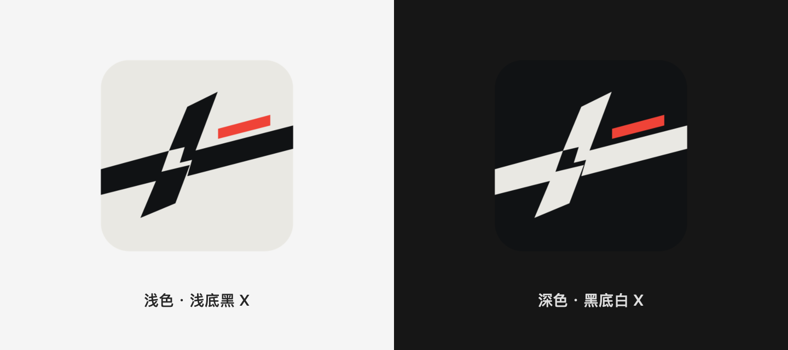

<p align="center">
  <picture>
    <source media="(prefers-color-scheme: dark)" srcset="branding/wgsense-icon.svg">
    
  </picture>
</p>

<h1 align="center">WgSense</h1>
<p align="center"><strong>看清链路，也管好连接。</strong></p>
<p align="center">为 Mac 打造的原生网络工作台。WireGuard、动态链路 HUD、Mihomo 代理面板与局域网传输。</p>

<p align="center">
  <a href="https://github.com/Zichao-xu/WgSense/releases/latest"><strong>下载 macOS 版</strong></a> ·
  <a href="#开始使用">开始使用</a> ·
  <a href="#常见问题">常见问题</a> ·
  <a href="https://github.com/Zichao-xu/WgSense/releases">更新记录</a> ·
  <a href="https://github.com/Zichao-xu/WgSense/issues">反馈问题</a>
</p>

<p align="center">Apple Silicon · macOS 26 或更新 · SwiftUI 原生界面 · Apache 2.0</p>



<p align="center"><sub>生产 HUD 组件的原生离线渲染，使用合成演示数据。实际读数来自你的连接。</sub></p>

> **下载前请了解：** 当前安装包尚未使用 Apple Developer ID 签名和公证，首次运行需要管理员授权安装后台服务。本机控制接口尚无调用者认证，当前更适合可信的个人 Mac；详见下方的安装与隐私说明。

## 你可以用它做什么

| 想做的事 | WgSense 提供的入口 |
| --- | --- |
| 在外连接家里或自己的服务器 | 导入 WireGuard `.conf`，管理多份配置，查看握手、流量和连接状态。你需要已有的 WireGuard 服务端配置。 |
| 少做重复的连接操作 | 自行设定受信任网段与自动连接策略；守护开启时，在受信任网络保持断开，在符合条件的外部网络尝试连接。 |
| 看懂链路发生了什么 | 「链路舞台」把最近 30 秒的收发、握手新鲜度与观测到的自愈记录放在一起，支持聚焦和逐点查阅。 |
| 管理已有的代理服务 | 连接自己的 Mihomo 控制器，查看策略组、节点、订阅与域名规则。需要另行运行 Mihomo。 |
| 给同一局域网的设备传文件 | 使用兼容 LocalSend 协议的传输模块，发现设备、发送文件，并在接收前确认。 |

## 链路有动态，也有依据

收发斜面随速率变化，握手触发扫描，自愈事件留下刻度。动画采用缓动与有限回弹，停下来后暂停连续刷新；支持系统「减少动态效果」。

- **移动指针**：构成轻微跟随，数值仍由真实流量决定。
- **点击接收 / 发送**：聚焦一个方向，再点恢复全部。
- **指向底部轨迹**：查看该次采样；点击固定，再点解除。
- **遇到缺测**：读数留空，不用旧数据假装仍在连接。

<details>
<summary><strong>展开观看 10 秒动态演示</strong></summary>



原生组件离线生成，使用合成数据。GIF 为压缩展示版本，不代表 App 实际帧率。App 活动动画按显示器刷新率更新，最高请求 120Hz；目前不承诺所有场景稳定 120fps。测量方法与边界见 [HUD 验证记录](docs/link-stage-spec.md)。

[查看清晰版视频](docs/images/hud-motion.mp4)

</details>

## 深色沉静，浅色清晰

黑白几何与少量状态色构成整个 HUD。浅色使用浅背景与黑色斜面，深色反转；品牌上的朱红短线保持一致。可在「设置 → 外观」选择浅色、深色或跟随系统，并调整背景材质。



<p align="center"></p>

<p align="center"><sub>应用内图标跟随外观；Dock、Finder 和通知使用固定的深色平面图标。</sub></p>

## 开始使用

### 1. 安装

从 [最新发布页](https://github.com/Zichao-xu/WgSense/releases/latest) 下载 **WgSense-macOS.dmg**，打开后将 **WgSense.app** 拖入「应用程序」，再从「应用程序」启动。安装包已包含所需后台组件。

当前官方包支持 **Apple Silicon（M 系列）Mac，macOS 26 或更新**。Intel Mac、Windows、Linux、iOS 和 Android 暂无本项目的官方安装包。

首次打开可能遇到 macOS 的开发者验证提醒。确认文件来自本仓库后，可按 [Apple 的打开说明](https://support.apple.com/zh-cn/102445) 在「系统设置 → 隐私与安全性」中处理。发布页同时提供 `SHA256SUMS.txt`，用于检查下载文件是否完整。

### 2. 完成首次授权

按 App 提示授权安装常驻后台服务。它负责建立 WireGuard 隧道、管理路由与 DNS。安装完成后，日常启动和连接操作使用已安装的服务；重新安装或维护系统服务时仍可能需要授权。

### 3. 导入你的 WireGuard 配置

打开「配置」，点击「导入」，选择服务端提供的 `.conf` 文件，保存并选中配置。WgSense 不提供 VPN 服务器或代理订阅；配置中的私钥请自行妥善保管。

### 4. 先手动连接，再按需开启守护

先连接一次，在概览中确认握手和流量，并实际访问你要使用的资源。需要自动化时，再到「设置」填写「受信任网络前缀」与自动连接选项，点击「应用」，然后按需开启守护。**新安装默认不填写信任前缀，不自动开启 VPN 或守护。**

前缀示例：`192.168.1.`；多个前缀用英文逗号分隔。这里按 IPv4 地址的开头匹配，不填写 `192.168.1.0/24` 这样的 CIDR。请按自己的实际网络填写。

任一有效物理网卡的 IP 命中信任前缀即视为可信，不依赖 Wi-Fi 名称。多网卡同时在线时，请把这一点纳入你的策略设置。

## 常见问题

<details>
<summary><strong>为什么在家里显示断开？</strong></summary>

守护开启且当前网络命中你配置的受信任网段时，WgSense 会保持 VPN 断开。这是预期策略。先检查「设置」中的信任网段，避免把不应信任的网络范围填进去。

</details>

<details>
<summary><strong>关闭窗口或退出 App，会断开 VPN 吗？</strong></summary>

关闭主窗口后，菜单栏仍可使用；退出 App 也不会自动停止已安装的常驻后台。需要同时关闭 VPN 与自动守护时，请先在 App 内点击「停止」，再退出。

</details>

<details>
<summary><strong>为什么系统设置里没有 WgSense 的 VPN 开关？</strong></summary>

当前 macOS 版通过自己的后台服务管理 WireGuard，不注册系统 VPN。连接和守护状态请在 WgSense 内查看。

</details>

<details>
<summary><strong>代理面板为空，或者发现不了传输设备？</strong></summary>

代理面板需要能访问的 Mihomo 控制器，以及正确的地址与密钥；默认地址是本机 `127.0.0.1:9090`。WgSense 不内置 Mihomo 内核。

局域网传输需要双方在可互通的网络上，并允许本地网络访问。默认端口为 `53317`；路由器的设备隔离、防火墙或 VPN 路由都可能影响发现。接收文件前会请求确认，也可在设置中关闭接收。

</details>

<details>
<summary><strong>如何更新或彻底卸载？</strong></summary>

**更新：** 下载新 DMG，先在 App 中点击「停止」，退出 App，再替换「应用程序」中的旧版。启动后按提示完成后台版本检查；后台升级可能重启服务，请在方便中断连接时进行。

**卸载：** 先停止连接，在「设置 → 后台服务」中使用「卸载」，完成后退出并移除 App。只把 App 拖入废纸篓不会卸载常驻服务。卸载服务保留用户配置与接收文件；删除前如有需要，请先在配置页导出备份。

</details>

<details>
<summary><strong>出现连接异常，反馈什么最有帮助？</strong></summary>

先在「设置 → 后台服务」查看诊断，再到 [Issues](https://github.com/Zichao-xu/WgSense/issues) 说明 App 版本、macOS 版本、操作步骤，以及预期和实际结果。注明是有线、Wi-Fi 还是多网卡环境，会更容易定位。

导出日志或诊断后，请先检查并隐去私钥、控制器密钥、个人地址和配置名称。不要把整份 WireGuard 配置直接贴到公开 Issue。异常动画表示遥测推断，不等同于已完成网络连通性检测。

</details>

## 隐私与当前边界

- WireGuard 配置与应用设置保存在本机；安装包不附带个人私钥或可用的服务器配置。Mihomo 地址与密钥由你提供。
- 连接会访问配置指定的服务器，代理管理会访问指定控制器。代理概览默认进行公网 IP 查询与连通性检测，会访问外部查询服务和测试站点；可在界面关闭自动检测。
- 后台启动时会启用局域网设备发现与接收服务，产生本地网络流量；接收文件需确认，也可在设置中关闭接收。
- 后台控制接口只监听本机 `127.0.0.1:8765`，**目前没有调用者认证**。本机其他进程或用户可能调用它；回环地址不构成权限隔离，不建议把当前版本用于不可信的多人共用环境。
- Apple Developer ID 签名与公证、真实冷重启和网络切换的完整验收仍待完成。连接恢复机制已加入测试，但不能据此保证每种网络都能自动恢复。

当前版本的变化与验证范围见 [v1.0.2 发布说明](docs/releases/v1.0.2.md)。

## 开发与贡献

界面使用 SwiftUI / AppKit，后台使用 Go 与 wireguard-go。当前交付重点是 macOS；其他平台仍属后续规划。

准备 Xcode、Go（版本见 `core/go.mod`）与 XcodeGen 后：

```sh
# Go 核心
cd core
go test ./...
cd ..

# macOS App
cd platforms/macos
xcodegen generate
open WgSense.xcodeproj
```

[链路 HUD 设计与验证](docs/link-stage-spec.md) · [品牌资源规范](branding/README.md) · [配图来源](docs/images/README.md) · [项目规划](docs/PROJECT-PLAN.md)

欢迎提交问题或改进。仓库代码以 [Apache License 2.0](LICENSE) 发布；第三方组件遵循各自许可证。
